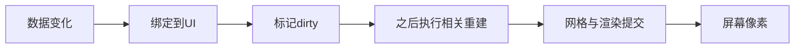

# 基础：读懂这两个UI实验需要什么

[学习入口](README.md) · [列表](LIST_REFRESH.md) · [渐变](GRADIENT_SUBDIVISION.md) · [Profiler](PROFILER_GUIDE.md)

## 1. 一帧不是一个函数

一帧可以先粗略理解成游戏推进并呈现画面的一次循环。CPU执行脚本、安排布局和图形提交；GPU处理图形工作。它们存在并行与等待，不能把所有线程和GPU区段的时间直接相加成帧时。

本项目[BenchmarkRunnerHost.cs](../../XUILab/Assets/XUILab/Benchmarking/Runtime/BenchmarkRunnerHost.cs)的Update把Time.unscaledDeltaTime乘1000传给runner.Tick：秒转换成毫秒（ms）。它描述帧间隔，不是用计时器包住某个函数的执行耗时。一次Update读到的间隔也不能无条件归因给刚刚在同一次Update中执行的更新；需要动作与样本时序证据。

例如理想稳定60FPS每帧约1000/60=16.67ms。帧间隔可能包括等待下一次显示或限帧，而非CPU一直忙16.67ms。降低计算量后限帧仍保持60FPS，也可能有价值，但是否降低CPU工作要另外测。不要把p95帧间隔倒数称为平均FPS。

阅读Unity调用时序可参考[Unity 2022.3事件执行顺序](https://docs.unity3d.com/2022.3/Documentation/Manual/ExecutionOrder.html)。本项目的正式动作由确定性Runner驱动，避免人工点击节奏影响比较。

## 2. C#源码的最小阅读方法

| 写法/术语 | 怎样理解 | 在本项目中怎样使用 |
| --- | --- | --- |
| class / 类 | 把数据与操作组织成一个类型 | ListView负责列表行为 |
| method / 方法 | 一段有名称、可调用的行为 | UpdateItem是调用入口之一 |
| property / 属性 | 从对象读取或设置状态的接口 | 不要以为所有赋值都只是改一个数字，可能触发失效 |
| interface / 接口 | 约定调用者可使用哪些操作 | 指标探针以IBenchmarkMetricProbeSet统一管理 |
| Dictionary / 字典 | 通过键查值的数据结构 | index对应当前Cell，避免遍历所有项找目标 |
| callback / 回调 | 在事件发生时被调用的函数 | dirty探针记录UI失效事件 |
| exception / 异常 | 执行中发现无法继续的情况 | 不能吞掉异常后仍写正确性pass |
| reentrancy / 重入 | 一次操作尚未结束，其回调又进入相关操作 | 用户Bind回调可能再次更新或销毁列表 |
| invariant / 不变量 | 操作前后必须始终成立的约束 | 一个Cell不能同时借给两个索引 |
| .meta / GUID | Unity资产身份信息 | 移动脚本/场景须保留引用身份 |
| asmdef / 程序集定义 | 代码编译与依赖边界 | Runtime不依赖UnityEditor；Tests引用被测程序集 |

先读公开入口的参数和校验，再跟进一个具体例子的分支；不要从文件第一行硬读到最后一行。看不懂私有辅助方法时记录“输入是什么、它保证什么”，再查对应测试。源码导航采用文件链接+symbol名称，避免修改后行号漂移。

协程（coroutine）是可以暂停并在后续时机继续的执行方式，不等于另开CPU线程。此概念常出现在PlayMode测试的等待帧代码里，详见[Unity协程手册](https://docs.unity3d.com/2022.3/Documentation/Manual/Coroutines.html)。

## 3. UI从数据到像素

这是阅读路线，不表示每次操作都会完整执行每一层，也不表示每个dirty立即重建一次。

| 术语 | 朴素解释 | 容易误解的地方 |
| --- | --- | --- |
| UGUI | Unity的Canvas UI系统 | 和UI Toolkit不是同一套系统 |
| Canvas | 一组UI的渲染组织单位 | 收到willRenderCanvases事件不等于发生一次完整重建 |
| RectTransform | UI矩形的位置、大小与锚点 | 布局坐标不等于最终屏幕像素 |
| Graphic / Text / Image | 可显示的UI组件及文字/图片类型 | 组件数量与Draw Call数不一一对应 |
| Cell | 一行列表的显示对象 | 一条数据不一定长期拥有一个Cell |
| Bind / Unbind | 把数据写入显示对象／解除旧数据关系 | 和创建／销毁不是一回事 |
| dirty / 失效标记 | 内容或几何需要更新的通知 | 通知次数不是CPU耗时或重建次数 |
| layout / 布局 | 决定大小与位置 | layout dirty不等于已测到布局执行成本 |
| Mesh / 网格 | 顶点与三角形组成的几何 | 图形更多不保证整帧一定更慢 |
| vertex / 顶点 | 带位置、颜色、UV等属性的点 | 颜色在顶点间还需要插值 |
| UV | 在纹理上取样的位置坐标 | 和UI局部坐标含义不同 |
| batch / 批次 | 可合并提交的一组图形工作 | 受材质、纹理、裁剪等影响，不只取决于顶点数 |
| shader / 着色器 | GPU处理顶点或像素的程序 | 本项目CPU细分实验不是渐变Shader对照实验 |

项目里要用真实观察把这条链连接起来；未测到的层不能靠术语猜一个数字。[列表篇](LIST_REFRESH.md)说明业务更新，[渐变篇](GRADIENT_SUBDIVISION.md)说明几何与颜色，[Profiler篇](PROFILER_GUIDE.md)说明耗时取证。

## 4. 对象池、虚拟化、缓存不是同一件事

对象池保存可复用对象，减少反复创建/销毁；虚拟化只为可见区及附近数据保留显示对象，限制活跃规模；缓存保存可复用计算结果。它们可以同时存在。

列表里leased是正在借用的Cell，cached是池内空闲Cell，unique关注不同实例；“当前借用13个”不能写成“总共只创建过13个”。渐变里缓存的是一组选择输入对应的截面结果，不能理解成所有bias结果都预先缓存。

缓存一定带来失效问题：数据变了什么时候重算？对象复用后旧状态如何清除？所以测试不仅检查正常画面，也检查离屏重入、重置、异常与生命周期。GC是托管垃圾回收；分配字节、回收次数、存活内存是不同量，没有GC回收不等于零分配。

## 5. 插值与误差的入门例子

线性插值：a到b之间的位置t（0到1），取值为a+(b-a)t。若a=0、b=10、t=0.25，结果是2.5。这是算术示例，不是实验结果。

非线性曲线变化速度不均匀，用少量直线段逼近时，拐弯大的区域通常需要更密的采样。固定细分把位置均分；自适应细分根据误差决定在哪里增加截面。段数是成本线索，误差才说明是否接近目标。

RGBA分别是红、绿、蓝、透明度。项目连续颜色和网格插值、量化后的颜色、屏幕像素属于不同检查层。Color32用每通道8位表示颜色（0到255）；这会限制可表达的精度，详见[Unity Color32](https://docs.unity3d.com/2022.3/Documentation/ScriptReference/Color32.html)。不能把0.01的连续RGBA误差直接解释成“肉眼只差1%”。

## 6. 怎样读实验统计

源码入口：[BenchmarkMeasurement.cs](../../XUILab/Assets/XUILab/Benchmarking/Runtime/BenchmarkMeasurement.cs)中的Percentile与PercentileSorted；测试入口：[BenchmarkStatisticsAndArtifactsTests.cs](../../XUILab/Assets/XUILab/Benchmarking/Tests/EditMode/BenchmarkStatisticsAndArtifactsTests.cs)。

p50是中位数，p95/p99描述排序后更靠近慢端的位置。项目采用排序数组的线性插值位置，不是任意挑第95帧。假设只有1、2、3、4、100ms五个样本，p95的位置是(5-1)×0.95=3.8（从0起），插值得4+0.8×(100-4)=80.8ms。这只是算法教学例子，正式实验每轮1800样本。

如果每60帧才更新一次，动作帧约占1.67%。p95可能主要看到无更新帧，p99才更可能暴露慢端；因此p95接近不能证明更新成本相同。看动作频率、p99和超预算比例，但不能看完结果后偷偷更换原定主判据。

报告的“五轮p95中位数”是先算每轮p95，再取五个数字的中位数，不是把9000帧拼接成一轮。预热300帧用于减少冷启动影响，冷开成本另列。独立进程重复是为了观察轮间波动；同一进程切五段不能自动代替五次独立运行。

| 状态 | 准确含义 |
| --- | --- |
| correctness pass | 本次约定的功能断言通过 |
| valid / invalid | 样本是否满足协议；失焦、超时等可能导致invalid |
| improved / regressed | 通过预设比较规则判断改善或退化 |
| inconclusive | 按规则无法可靠区分，不等于证明完全一样 |
| unavailable | 该指标没有可用数据，不是0 |
| not_run | 根本没有执行该检查 |
| not_assessed | 本次没有评价这个维度 |

更多项目约束见[性能证据规范](../Agents/PERFORMANCE_EVIDENCE.md)和[测量协议](../MVP/MEASUREMENT_PROTOCOL.md)。

## 7. 身份为什么也是知识的一部分

candidate是某次被审查的源码候选；commit是Git提交；dirty表示存在未提交工作树变化，不表示代码必定错误；build-id标识构建；run-id标识运行；SHA-256校验文件字节是否一致。哈希相同不证明方法正确，哈希不同则不能冒称原证据。

本项目探索数据有冻结清单，即使dirty也可解释其来源；但M4正式公开结论有新的干净候选要求。详细入口见[证据导航](EVIDENCE_NAVIGATION.md)。

## 自查（可直接看答案）

一次操作发出18个dirty回调，可否称为18次Canvas重建？

不可以。前者是失效通知，后者是实际执行的另一种工作。事件可合并，诊断还涉及不同阶段；必须有对应重建观测或marker才可计数和计时。

报告说GC unavailable，可否在作品介绍中写“零GC”？

不可以。缺数据与测到零不同；还需要明确说的是分配、回收还是存活内存。

