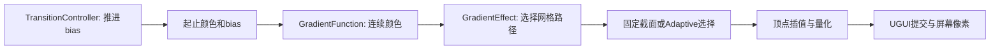

# 渐变与自适应细分：从颜色函数到Player证据

[学习入口](README.md) · [基础](FOUNDATIONS.md) · [列表](LIST_REFRESH.md) · [Profiler](PROFILER_GUIDE.md) · [证据导航](EVIDENCE_NAVIGATION.md)

本篇的主线是：连续颜色函数→截面选择→分段插值→Color32量化→屏幕像素。每层都有自己的误差和成本，不能互相代替。源码说明实现，测试说明行为边界，[固定段报告](../Experiments/GRADIENT_SUBDIVISION_RESULTS.md)与[自适应报告](../Experiments/GRADIENT_ADAPTIVE_RESULTS.md)说明实际观测。

## 1. 先建立直觉：为什么需要中间的点

渐变就是颜色随位置变化。用t=0表示起点，t=1表示终点；水平模式沿左右，垂直模式沿上下。

对于矩形、均匀底色的线性渐变，四个角点的颜色可以表达目标。三角形内部插值顶点颜色；一般非线性曲线会弯，用两端直线连起来不能准确表达中间。细分是在中间增加截面，让每段只近似曲线的一小部分。这里的说明针对项目合同，不能推广成任意纹理/底色/Shader的像素保证。

- 顶点：几何中的点，还带颜色、UV、normal等属性。
- 三角形：由3个顶点索引确定的面。一个矩形常用两个三角形。
- 截面：沿渐变方向某个位置的一对点，例如水平渐变的底边点和顶边点。
- 段：两个相邻截面间的小矩形。
- topology/拓扑：顶点如何被索引连接，不只看顶点数。
- fallback/降级：保留原拓扑，对已有顶点着色，不强行细分。
- tolerance/容差：允许的误差目标；cap/上限：最多能使用多少段。



## 2. 四个类型怎样分工

| 类型与源码 | 负责什么 | 不负责什么 |
| --- | --- | --- |
| [GradientFunction.cs](../../XUILab/Assets/XUILab/GradientLab/Runtime/GradientFunction.cs) | Weight/Evaluate定义颜色，Normalize验证，Quantize转8位 | 不改Mesh、不管理动画 |
| [GradientEffect.cs](../../XUILab/Assets/XUILab/GradientLab/Runtime/GradientEffect.cs) | ModifyMesh读取参数、选择路径并写VertexHelper | 不决定时间怎样推进 |
| [GradientSegmentSelector.cs](../../XUILab/Assets/XUILab/GradientLab/Runtime/GradientSegmentSelector.cs) | Select/Error计算截面与误差估计 | 不保证任意最终像素 |
| [GradientTransitionController.cs](../../XUILab/Assets/XUILab/GradientLab/Runtime/GradientTransitionController.cs) | StartTransition/SetProgress推进Bias，处理终态 | 不直接生成顶点 |

先看这些公开入口，再跟一个输入的分支；细节合同见[Gradient合同r2](../Experiments/GRADIENT_CONTRACT-r2.md)。

## 3. GradientFunction：把“渐变”变成明确公式

### 线性与Schlick bias

线性模式Weight返回w(t)=t。非线性模式使用：

```text
w(t) = t / ((1 / bias - 2) * (1 - t) + 1)
color(t) = start + (end - start) * w(t)
```

[GradientFunction.Weight](../../XUILab/Assets/XUILab/GradientLab/Runtime/GradientFunction.cs)先拒绝非有限值，把bias限制到0.05..0.95，把t限制到0..1。代入t=0.5可得w(0.5)=bias，因此bias可以直观理解成“中点偏向终点多少”。

| bias | w(0) | w(0.5) | w(1) | 直观 |
| --- | ---: | ---: | ---: | --- |
| .25 | 0 | .25 | 1 | 前半更偏起点，后半变化较快 |
| .5 | 0 | .5 | 1 | 退化成线性 |
| .95 | 0 | .95 | 1 | 较早接近终点 |

黑到白、bias=.25的中点RGB为(.25,.25,.25)，这是公式算例。Evaluate用规范化start/end和权重插值RGBA；RGB与alpha都遵守本项目encoded-rgb数值合同，不应自行加gamma转换。端点、中心和单调性测试在[GradientMeshTests.CurveHasFixedEndpointsCenterAndMonotonicity](../../XUILab/Assets/XUILab/GradientLab/Tests/EditMode/GradientMeshTests.cs)。

### 输入底色与量化

GradientEffect将输入UIVertex.color与Evaluate(t)逐通道相乘，然后Quantize。项目量化规则为floor(clamp(x)*255+0.5)，例如输入alpha83/255再乘0.5，量化后约42。不是把透明度重复乘两次。

[GradientMeshTests.cs](../../XUILab/Assets/XUILab/GradientLab/Tests/EditMode/GradientMeshTests.cs)中的LinearPreservesTopologyAndMultipliesInputAlphaOnce、SubdivisionQuantizesOnlyAfterInterpolationAndMultiplication检查这一点。细分先做浮点插值和乘色，最后量化，不在中间反复转Color32。

RGBA连续误差0.01是四通道数值合同，不代表肉眼“只差1%”。连续函数、分段函数、量化颜色和屏幕像素必须分别评估；Color32基础见[FOUNDATIONS](FOUNDATIONS.md)。

## 4. GradientEffect：不是所有输入都走细分

GradientEffect继承BaseMeshEffect。UGUI调用ModifyMesh时，它读取输入VertexHelper并按条件修改。属性setter先规范化/验证，再比较实际值；同值不重复Dirty。FixedSegments范围1..64，默认32；ConfigureAdaptive对min/max/tolerance整体校验。

| LastMode | 主要条件 | 行为 |
| --- | --- | --- |
| Disabled / Empty | 禁用或没有顶点 | 不新增几何 |
| Degenerate | 宽高退化 | 安全返回 |
| InvalidInput | 顶点属性含非有限值 | 不把坏数据继续插值 |
| LinearVertices | Linear曲线 | 只改已有顶点颜色 |
| FixedSegments | Nonlinear、受支持矩形、Fixed | 均匀生成截面 |
| AdaptiveSegments | Nonlinear、受支持矩形、Adaptive | 根据选择器结果生成截面 |
| VertexFallback | Nonlinear输入不满足完整细分条件 | 保留原拓扑，给已有顶点着色 |

[GradientEffect.StrictRectangle](../../XUILab/Assets/XUILab/GradientLab/Runtime/GradientEffect.cs)不只检查4顶点，还检查轴对齐四角、6索引、非退化三角形、绕序和对角线、UV仿射关系等。non-Simple Image的Sliced/Tiled/Filled等保持原拓扑。fallback有颜色结果，但不代表达到了完整非线性曲线目标。

相关测试：[GradientMeshTests.cs](../../XUILab/Assets/XUILab/GradientLab/Tests/EditMode/GradientMeshTests.cs)的FixedRectangleHasSharedSectionsChannelsAndOriginalWinding、UnsupportedImageTypesKeepTopology、DuplicateTriangleAndNonAffineUvsFallBack、EmptyDegenerateAndDisabledDoNotCreateGeometry。

### 固定段数怎么变成顶点

设段数n：截面n+1，顶点2(n+1)，三角形2n，索引6n。例如n=32得到33截面、66顶点、64三角形、192索引。不要把192索引说成192顶点。

[GradientEffect.Subdivide](../../XUILab/Assets/XUILab/GradientLab/Runtime/GradientEffect.cs)把截面映射到矩形。水平沿底边/顶边插值，垂直沿左右边插值；position、normal、tangent、uv0..uv3和颜色按要求保留与插值，再乘渐变并量化。测试FixedSegmentSettingIsBoundedAtomicAndDefaultsTo32与网格测试检查范围、拓扑和通道。

## 5. 自适应：每次拆分误差最大的区间

[GradientSegmentSelector.Select](../../XUILab/Assets/XUILab/GradientLab/Runtime/GradientSegmentSelector.cs)的AlgorithmVersion为schlick-greedy-midpoint-v1。

1. 验证1≤min≤max≤64及容差范围。
2. 先均分成min段。
3. 估计每段“用端点连成直线”与连续曲线的最大差。
4. 找最差一段，同误差时保持最左选择，保证确定性。
5. 在该段中点插入截面，重新计算两小段误差。
6. 达到容差或上限就停止；浮点中点无法继续分割也会终止并返回真实状态。
7. 超标则QualityLimited=true，不偷偷放宽容差。

这不是找到理论最优分段的证明，而是有上限、确定性的贪心算法。greedy指每次先处理当前最坏区间；midpoint指插入几何中点。它把更多段分给弯曲剧烈的地方。

<details>
<summary>进阶：代码中的解析弦误差公式</summary>

在区间[u,v]，设a=(1-bias)/bias，d(x)=a+(1-a)x，span是起止颜色四通道最大绝对差。Error的主体为：

```text
span * abs(a*(a-1)) * (v-u)^2
------------------------------------------------
d(u)*d(v)*(sqrt(d(u))+sqrt(d(v)))^2
```

再加NumericMargin=0.000002；span=0时直接返回0。线性模式使用a=1。这里a是改写后的分母参数，不是上一节公式里的“1/bias-2”。Error与Select在同一个[选择器文件](../../XUILab/Assets/XUILab/GradientLab/Runtime/GradientSegmentSelector.cs)。第一次阅读只需理解“每段有误差估计，先拆最坏段”。

[GradientAdaptiveTests.DenseFloatOracleIsBoundedAcrossBiasColorAndTolerance](../../XUILab/Assets/XUILab/GradientLab/Tests/EditMode/GradientAdaptiveTests.cs)用密集数值参考检查估计边界，并检查位置单调和确定性。dense oracle意为较密的独立参考计算，不是新的Player帧时测量。

</details>

### 估计与质量标记有什么边界

EstimatedMaxError约束未量化渐变函数的分段误差；它不自动包含纹理、任意底色变化、量化、Shader和最终像素。Effect只有走受支持的Adaptive矩形且四角Color32相同，才设置OutputQualityAssessed；这个名字也不意味着整条渲染链的任意像素都有保证。

底色不同或fallback时，测试[FallbackAndVaryingBaseColorNeverClaimOutputQuality](../../XUILab/Assets/XUILab/GradientLab/Tests/EditMode/GradientAdaptiveTests.cs)要求不声称该输出质量已评估。达到上限仍超标的路径由ConstantCenterLinearAndCapHaveExplicitOutcomes等覆盖。

## 6. 缓存省的是什么，失效又是什么

[GradientEffect.EnsureSelection](../../XUILab/Assets/XUILab/GradientLab/Runtime/GradientEffect.cs)只缓存最近一组选择结果。键包含start/end、bias、curve、min/max、tolerance。变化后下一次相关网格重建重新选择；不是所有bias答案都常驻内存。

几何尺寸和方向不在键中：同一归一化颜色曲线可以复用截面，再映射到新矩形。首次Adaptive使用会分配固定容量缓冲，后续复用。不能由此声称整个应用“零分配”或“零内存成本”。

测试[CacheIncludesEverySelectionInputButReusesForGeometryAndDirection](../../XUILab/Assets/XUILab/GradientLab/Tests/EditMode/GradientAdaptiveTests.cs)检查键与复用；PlayMode的[AdaptiveCacheSurvivesGeometryChangesAndReenableWithoutStaleMesh](../../XUILab/Assets/XUILab/GradientLab/Tests/PlayMode/GradientLifecycleTests.cs)检查尺寸变化和重新启用。

静态场景建好后采样期间没有新选择调用，所以缓存命中计数也可能是0：没有调用就没有命中事件，不等于缓存坏了。动态bias不断改变，通常需要重新选择，这是质量换来的一部分维护成本。

## 7. 过渡控制：随时间改参数，而不是亲自画网格

[GradientTransitionController.cs](../../XUILab/Assets/XUILab/GradientLab/Runtime/GradientTransitionController.cs)通过effect.Bias驱动Effect：

| 方法/配置 | 行为 |
| --- | --- |
| StartTransition | 验证起止bias和duration，立即应用起点 |
| duration≤0 | 直接完成到终点 |
| SetProgress | 拒绝NaN/无穷，把进度限制到0..1；无运行时不继续推进 |
| Linear / SmoothStep | 线性进度p／p²(3-2p)，改变推进节奏 |
| Automatic / Clock | 自动推进，选择scaled或unscaled delta |
| Cancel(false) | 停在当前值，Cancelled |
| Cancel(true) | 到终点，Completed |
| disable/destroy | 活动过渡停止，不因重新启用自动续播 |

scaled随Time.timeScale变化；unscaled不受该缩放影响，适合需要在暂停时继续的UI。相关[GradientLifecycleTests](../../XUILab/Assets/XUILab/GradientLab/Tests/PlayMode/GradientLifecycleTests.cs)包括TransitionInterruptCancelAndReuseHaveStableTerminals、InvalidStartAndProgressCannotPartiallyMutateAnActiveTransition、UnscaledAutomaticProgressEndsWhileScaledClockIsPaused。

过渡值改变可能触发dirty并在后续生成网格。DirtyCount/RebuildCount是组件记录，不能直接叫作Canvas整体次数或CPU毫秒。

## 8. G1：为什么Fixed64仍没达到0.01

[G1报告](../Experiments/GRADIENT_SUBDIVISION_RESULTS.md)在8种情景、4档段数、各5个独立进程得到160次有效Player运行。质量使用4097个连续参考点，比较encoded-rgb/straight RGBA四通道最大绝对误差，细节以[协议](../Experiments/GRADIENT_SUBDIVISION_PROTOCOL-r1.md)为准。

| 固定段数 | 极端bias连续最大误差（约） | 是否≤0.01 |
| --- | ---: | --- |
| 8 | 0.19047 | 否 |
| 16 | 0.09471 | 否 |
| 32 | 0.03842 | 否 |
| 64 | 0.01305 | 否 |

均匀切段在平缓位置花掉了不少段，高曲率位置仍可能不够密。这不表示64段“无用”，而是它在当前极端bias目标下仍quality_limited。

受控像素与实际分段量化函数参考吻合，和分段函数是否逼近连续目标是两层判据。“画出来符合粗网格”不等于“粗网格符合连续曲线”。不能用像素参考通过抵销连续误差失败。

## 9. G2：这次1..12段，不能写成永久保证

[G2报告](../Experiments/GRADIENT_ADAPTIVE_RESULTS.md)比较Fixed32与Adaptive：8情景×2策略×5独立进程=80个有效正式运行；4个有效pilot另计。配置min1/max64/tolerance0.01，见[协议](../Experiments/GRADIENT_ADAPTIVE_PROTOCOL-r1.md)。

| 本次矩阵观察 | Fixed32 | Adaptive |
| --- | --- | --- |
| 极端bias连续误差 | 约0.0384221 | 约0.00723908 |
| 极端bias段数 | 32 | 12 |
| 单组件顶点/三角形 | 66/64 | 26/24 |
| 中心bias段数 | 32 | 1 |

600个动态bias输入的最大误差约0.009941919907；实际观测1..12段。max64是上限而非使用量；换颜色跨度、容差、曲线或限制后可能需要更多段或仍超标。

### 静态与动态分别看

六个静态对照均为inconclusive；单组件动态也不确定。静态网格不是每帧都重新生成，整帧还有其他固定工作与等待，所以减少顶点不一定能测出帧间隔改善。

100组件的grid-dynamic五轮p95中位数从9.123955ms到4.723390ms，按预设规则improved，约-48.23%。第一对跨2026-09-08/09且Editor背景状态不同；轮2–5同日补充方向约-48.38%，是辅助解释，不能删掉首轮或隐去混杂。原始[矩阵报告（历史记录未公开）](../Showcase/HISTORICAL_RECORDS.md)保留五轮与失败排除记录。

Adaptive选择计时约0.094ms/采样帧（100组件），包含缓存检查和计时开销，也已经计入帧间隔。平均选择计时与p95差不能直接相减归因。CPU/GC/内存/UI/GPU分项unavailable，因此不能写成“CPU或GPU省了48%”。


此图来自已有实验，不是新采样。三个面板分别读：

- 左：横轴五次独立重复，纵轴100组件动态场景p95帧间隔（ms）。灰色第一轮提醒跨日；蓝线Fixed32，橙线Adaptive。纵轴没有从0开始，应读数值，不能只按线距推比例。
- 中：极端/中心/动态输入的未量化连续RGBA最大误差，红虚线是0.01目标。它不是屏幕像素误差；图例adaptive64指允许上限64，实际本实验1..12段。
- 右：每轮1800帧内选择器累计计时（ms），分别是1组件和100组件。不是单帧p95，不能直接和左图相减；除以1800才能得到每采样帧的平均选择计时。

图缺失时按[证据导航](EVIDENCE_NAVIGATION.md)找Artifacts归档，表格和原报告仍可作为阅读入口。

## 10. 为什么默认仍保留Fixed32

[综合决定](../Experiments/M3_OPTIMIZATION_DECISIONS.md)维持Fixed32兼容默认，Adaptive显式可选。这不等于宣称Fixed32满足所有质量目标。对受支持矩形、规定曲线与底色，需要0.01目标时可以显式选择Adaptive并检查quality_limited；对其他拓扑/底色/材质不能自动扩大保证。

选择算法增加了配置、缓存失效与维护责任。质量达标、减少几何、整帧改善三个目标要分别看；一组动态改善不能证明所有场景都值得切换默认。

## 11. 源码与测试阅读顺序

| 顺序 | 入口 | 问题 |
| --- | --- | --- |
| 1 | [GradientFunction](../../XUILab/Assets/XUILab/GradientLab/Runtime/GradientFunction.cs)：Weight/Evaluate/Quantize | 连续目标和量化规则是什么？ |
| 2 | [GradientEffect](../../XUILab/Assets/XUILab/GradientLab/Runtime/GradientEffect.cs)：ModifyMesh/StrictRectangle/Subdivide | 输入走哪条路径？顶点如何生成？ |
| 3 | [GradientSegmentSelector](../../XUILab/Assets/XUILab/GradientLab/Runtime/GradientSegmentSelector.cs)：Select/Error | 哪段误差最坏，何时停止？ |
| 4 | GradientEffect.EnsureSelection | 什么变化需要重算，什么可以复用？ |
| 5 | [GradientTransitionController](../../XUILab/Assets/XUILab/GradientLab/Runtime/GradientTransitionController.cs) | 时间怎样驱动参数，怎样结束？ |
| 6 | [GradientMeshTests](../../XUILab/Assets/XUILab/GradientLab/Tests/EditMode/GradientMeshTests.cs)、[GradientAdaptiveTests](../../XUILab/Assets/XUILab/GradientLab/Tests/EditMode/GradientAdaptiveTests.cs) | 数学、拓扑、缓存和失败边界如何检查？ |
| 7 | [GradientLifecycleTests](../../XUILab/Assets/XUILab/GradientLab/Tests/PlayMode/GradientLifecycleTests.cs) | 真实Canvas/启停/过渡是否正确？ |
| 8 | [G1](../Experiments/GRADIENT_SUBDIVISION_RESULTS.md)、[G2](../Experiments/GRADIENT_ADAPTIVE_RESULTS.md) | 质量与性能实际测到了什么？ |
| 9 | [Profiler指南](PROFILER_GUIDE.md) | 哪个耗时问题仍需要独立capture？ |

## 12. 可直接展开的参考解释

<details>
<summary>为什么少量非均匀段可能比很多均匀段准确？</summary>

因为曲率不均匀。自适应优先在误差大的位置加点，减少平缓位置的浪费。这是本算法和实验中的现象，不是任意函数的最优段数证明。

</details>

<details>
<summary>Adaptive最多12段是否是API保证？</summary>

不是。1..12是这次冻结输入的观察值；API允许到64且可能quality_limited。输入、容差、底色、拓扑变化都要重新检查范围。

</details>

<details>
<summary>OutputQualityAssessed=true是否保证最终屏幕每个像素误差≤0.01？</summary>

不能这样理解。它有受支持矩形与均匀输入底色条件，估计针对未量化渐变函数。纹理、量化、混合与最终屏幕需要另外的参考和验证。

</details>

<details>
<summary>缓存命中0为什么不一定是缓存失效？</summary>

静态稳态根本可能没有再调用选择器，没有查询就没有命中计数。动态bias变化导致重新选择也符合键失效合同。

</details>

<details>
<summary>顶点减少，静态inconclusive，二者矛盾吗？</summary>

不矛盾。几何规模下降是实测工作量之一；静态网格可复用，整帧可能受其他工作和噪声影响。没有可区分帧间隔改善不等于证明没有任何价值。

</details>

<details>
<summary>动态改善48%能否归因CPU？</summary>

不能。测到的是限定环境中的帧间隔，首对还跨日。缺少CPU/GPU/UI分项时，只能保留有边界的结果和待验证解释。

</details>

读完后可以把任何一段和它的源码链接交给Agent解释；无需先完成口头测试。实际学习理解和文档完成仍分开记录。
