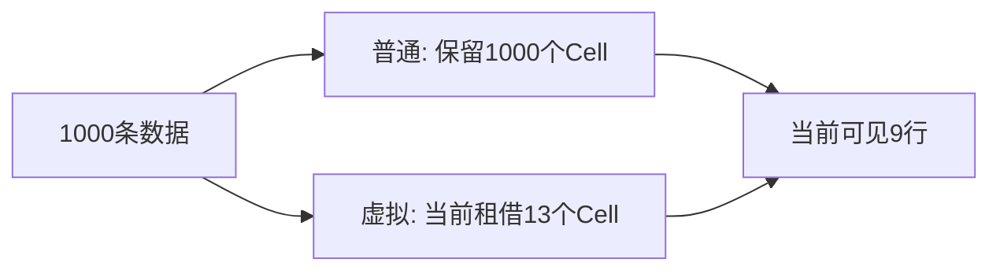

# 列表刷新：从一项数据走到UGUI网格

[学习入口](README.md) · [基础](FOUNDATIONS.md) · [渐变](GRADIENT_SUBDIVISION.md) · [Profiler](PROFILER_GUIDE.md) · [证据导航](EVIDENCE_NAVIGATION.md)

本篇按“数据→显示对象→刷新策略→正确性→实验”阅读。每个源码链接旁给出方法或字段名，打开后搜索symbol即可；不要求先通读整个项目。

## 1. 数据、Cell与画面先分开

[ListItem.cs](../../XUILab/Assets/XUILab/ListLab/Runtime/ListItem.cs)保存Id、Template、Label。它只是数据，不负责绘制。一条数据没有出现在屏幕时，不一定需要显示对象。

[ListCell.cs](../../XUILab/Assets/XUILab/ListLab/Runtime/ListCell.cs)中的ListCell是挂在GameObject上的组件，Create建立Wrapper、Image、CanvasGroup和Label Text等对象。Cell保存当前Index、ItemId、Template、BindCount、UnbindCount。一个Cell可以先显示索引14，滚动复用后显示另一项。因此“第14项数据变了”和“某个Cell重新显示了第14项”是两件事。

[ListView.cs](../../XUILab/Assets/XUILab/ListLab/Runtime/ListView.cs)中的cells字典保存索引到当前Cell的关系，Cells提供只读访问入口。本项目不是新发明字典；改进重点是正确发布数据、选择刷新对象，并处理离屏和异常。

| 词 | 直观意思 | 代码落点 |
| --- | --- | --- |
| Bind | 把数据写到显示对象 | ListCell.Bind |
| Unbind | 清除旧绑定与文字，重置显示状态 | ListCell.Unbind |
| Rebind | 同一对象先Unbind再Bind | [ListCellPool.Rebind](../../XUILab/Assets/XUILab/ListLab/Runtime/ListCellPool.cs) |
| viewport | 用户能看到的窗口矩形 | ListView.Scroll与Intersects |
| prefetch | 可见区前后额外保留的行 | ListView.Prefetch、GetWindow |
| leased / cached | 正在借用／已归还等待复用 | ListCellPool.Leased、Cached |
| pending | 数据已更新、显示同步尚未完成的索引 | ListView.pending、PendingRefreshCount |
| dirty | UI需要后续处理的失效通知 | 不等于立即重建，也不是耗时 |

更多术语见[基础篇](FOUNDATIONS.md)。

## 2. 为什么可见9行，却借出13个Cell

实验使用1000条数据、48px行高、384px视口、offset492。视口从第10行内部开始，到第18行内部结束，因此索引10–18共9行部分或全部可见。虚拟窗口前后各预取2行，租借8–20共13行。

[ListView.GetWindow](../../XUILab/Assets/XUILab/ListLab/Runtime/ListView.cs)计算租借范围，Intersects判断某行是否真正与视口相交，Reconcile让实际Cell集合跟上窗口。普通模式会保留全表1000个Cell；虚拟模式保留窗口附近Cell。数字9/13是当前几何与配置的结果，不适用于所有视口。



对象池解决重复创建/销毁，虚拟化解决活跃规模，两者互补。[ListCellPool.Rent](../../XUILab/Assets/XUILab/ListLab/Runtime/ListCellPool.cs)按模板取缓存，没有才创建；Return执行解除绑定、停用、移到cacheRoot，再按容量缓存或销毁；ValidateOwnership核对所有权。

leased、active、visible、Created、UniqueTotal不能混用。leased是借用，active是实际启用，visible是几何相交；Created是累计创建，UniqueTotal是池当前拥有的不同实例总数。13个leased不表示历史只创建过13个。[ListCellActivity.cs](../../XUILab/Assets/XUILab/ListLab/Runtime/ListCellActivity.cs)跟踪启用状态，[ListViewTests.cs](../../XUILab/Assets/XUILab/ListLab/Tests/PlayMode/ListViewTests.cs)中的ActualActivityDetectsDisabledLeasedCell验证禁用一个借用Cell会被检查发现。

## 3. 一次重新绑定为什么会触发额外工作

阅读[ListCell.Bind/Unbind](../../XUILab/Assets/XUILab/ListLab/Runtime/ListCell.cs)：Bind重置视觉、写Index/ItemId/Label.text并更新计数；Unbind清空Label、清除身份并重置视觉。Pool.Rebind不是只改一个整数，而是Unbind→Bind。

```text
重新绑定一行
  → 清空旧Text，再写入新Text
  → Graphic发出失效通知
  → 后续布局/网格阶段处理需要的工作
  → 组织渲染提交
```

这只是工作链路，不表示每次通知都会独立执行完整重建。[FixedRowLayout.cs](../../XUILab/Assets/XUILab/ListLab/Runtime/FixedRowLayout.cs)的SetLayoutVertical按Index与RowHeight安排位置；模板切换等情况会触发布局失效，但没有布局计时就不能说它耗了多少ms。

相同模板可Rebind；模板改变则在[ListView.RefreshIndexCore](../../XUILab/Assets/XUILab/ListLab/Runtime/ListView.cs)中归还旧Cell、租借新模板并Bind。插入/删除/重排不是内容更新：SetItems复制验证整个数据源，释放并重建映射，以稳定ItemId恢复位置。不要用结构重置的Bind总数描述单项更新成本。

## 4. 先解释旧观测，再读新实现

[历史基线报告](../Experiments/LIST_REFRESH_BASELINE.md)观察旧M1 Runtime。诊断通过反射直接替换私有items，再调用原RefreshItem；这是刻意取证，不是当前公开API的正确用法。旧字节在[冻结ListView.cs](../../Artifacts/baselines/list-refresh-trace-r1/XUILab/Assets/XUILab/ListLab/Runtime/ListView.cs)，不能把当前方法名倒套成旧源码结构。

旧行为是扫描当前cells，对可见行全部重新绑定。普通/虚拟扫描1000/13项，最终都是9次Bind。目标可见时目标只占其中1次；目标离屏时目标Bind为0，但窗口仍做9次Bind。

[trace.json](../../Artifacts/list-refresh-trace-r1/trace.json)中name=middle、backend=normal记录target=14、targetBinds=1、totalBinds=9、scannedCells=1000。虚拟对应scannedCells=13。计数的采样和聚合见[RefreshTraceTests.cs](../../XUILab/Assets/XUILab/ListLab/Tests/PlayMode/RefreshTraceTests.cs)及[Profiler篇的逐字段示例](PROFILER_GUIDE.md)。这个旧诊断有冻结前提，不应对当前源码直接重跑并覆盖旧输出。

旧反射场景还暴露了离屏保留Cell的旧文字问题：内部数据改了，retained Cell未必重新绑定；虚拟列表很远的目标后来重新租借时则可获得新数据。新公开API必须让入屏后的画面正确，不能用“不更新文字”换取低计数。

## 5. 当前公开API的共同前半段

[ListView.UpdateItem](../../XUILab/Assets/XUILab/ListLab/Runtime/ListView.cs)的主要阅读顺序：BeginMutation→ValidateUpdate→Publish→按RefreshPolicy分支→EndMutation。

ValidateUpdate检查索引、非空Item与稳定Id。内容更新不能偷偷变成结构身份变化；需要换Id或插删时走SetItems。Publish比较Template与Label，相同内容不重复派发；确有变化才更新items[index]并加入pending。

这里的数据发布和显示同步分开：数据可以已经是新的，但离屏Cell等待后续同步。不能通过反射改私有items来绕过pending，因为这会跳过正确性合同。

### 两种策略的后半段

| 情况 | VisibleWindow | TargetOnly |
| --- | --- | --- |
| 一项可见数据改变 | 扫描当前cells，刷新全部9个可见项 | 判断目标是否相交，只刷新目标1项 |
| 一项离屏数据改变 | 仍刷新可见窗口，目标pending保留 | 立即Bind0项，目标pending保留 |
| 批量正好修改9个可见项 | 一次窗口扫描，Bind9项 | 检查批次索引，Bind9项 |

当前实现中的窗口分支为RefreshWindowCore，目标分支进入RefreshIndexCore。注意：表格的9对应实验视口；“离屏Bind0”描述TargetOnly该次派发，而非整帧所有系统绝不做任何工作。

## 6. pending如何保证入屏后是新内容

[ListView.FlushPendingVisible](../../XUILab/Assets/XUILab/ListLab/Runtime/ListView.cs)检查真实可见范围的pending索引。滚动、位置变化、Reconcile等路径让窗口和显示重新同步。RefreshIndexCore只有成功绑定后才移除pending。

- 可见同模板：Rebind后移除pending。
- 离屏但Cell仍在：暂时允许旧内容，真正入屏时FlushPendingVisible刷新。
- 虚拟列表里暂时没有Cell：进入租借窗口时Reconcile取得Cell并直接Bind最新数据，可能在真正可见前就完成。

ValidateState仅允许“pending且仍离屏”的Cell暂时落后；可见内容仍旧会失败。测试[RefreshUpdateTests.cs](../../XUILab/Assets/XUILab/ListLab/Tests/PlayMode/RefreshUpdateTests.cs)中的VisibleAndOffscreenTemplateUpdates、PendingUpdatesSurviveScrollResizeDisableAndDestruction覆盖可见/离屏、模板、滚动、resize、禁用和销毁。

### 批量更新的原子性要说清范围

UpdateItems先复制并验证整个批次，batchIndices拒绝重复索引，全部输入有效后才Publish。非法输入不会发布半批数据。**这不等于UI派发抛异常时会自动回滚已发布数据**：回调失败后可能保留新数据与待恢复的显示状态。对应测试为InvalidUpdatesAreAtomicAndBatchHasOneDispatch、BatchDispatchFailurePreservesPublishedDataAndExplicitRecovery。

## 7. 回调、重入和异常为什么占这么多代码

回调可能在设置Text时执行；如果回调再次UpdateItem，第一次操作尚未完成，第二次就进入了同一列表，这叫重入。

[ListView.BeginMutation](../../XUILab/Assets/XUILab/ListLab/Runtime/ListView.cs)通过mutating拒绝嵌套公开修改。滚动和生命周期变化采用scrollDeferred/lifecycleDeferred，交给EndMutation在外层结束时协调Reconcile或ReleaseAll，并限制收敛轮数。不是所有回调都可以任意安全重入。

Bind失败时RefreshIndexCore清除坏映射、保留pending、尝试归还租借对象并标dispatchFaulted。ReturnAfterFailedBind与[ListCellPool.Return](../../XUILab/Assets/XUILab/ListLab/Runtime/ListCellPool.cs)负责异常清理；不能吞掉异常后宣称ready。SetItems或UpdateEffects是需要结合实际状态使用的显式恢复入口。

| 风险 | [RefreshUpdateTests.cs](../../XUILab/Assets/XUILab/ListLab/Tests/PlayMode/RefreshUpdateTests.cs)中的阅读symbol |
| --- | --- |
| 嵌套修改后guard能否恢复 | NestedMutationsAreRejectedAndGuardRecovers |
| 回调中禁用/启用/滚动能否收敛 | DeferredScrollAndLifecycleReachFinalState |
| Bind失败是否遗留孤儿租借 | ThrowingBindCallbacksLeaveNoOrphanLeaseAndCanRecover |
| 批量派发失败后数据与恢复关系 | BatchDispatchFailurePreservesPublishedDataAndExplicitRecovery |
| 多次Unbind失败是否继续清理 | ReleaseAllContinuesAfterEveryUnbindFailure |

这些测试证明约定场景的正确性，不证明任何未知插件回调都安全，也不提供Player性能数字。

## 8. 从dirty计数读到性能边界

[RefreshUpdateTests.DirtyAndMeshFollowSelectedCells](../../XUILab/Assets/XUILab/ListLab/Tests/PlayMode/RefreshUpdateTests.cs)安装dirty回调和[RefreshMeshProbe](../../XUILab/Assets/XUILab/ListLab/Tests/PlayMode/RefreshMeshProbe.cs)。该测试场景的结果：

| 策略 | Bind | vertex dirty | layout dirty | Mesh探针调用 |
| --- | ---: | ---: | ---: | ---: |
| TargetOnly | 1 | 2 | 1 | 1 |
| VisibleWindow | 9 | 18 | 9 | 9 |

多个dirty可能被合并；Canvas.willRenderCanvases是事件；Mesh探针是观察者，记录调用/顶点，不改网格也不记录执行时间。诊断安装回调、探针和显式flush自身也有扰动。因此次数下降证明选中的相关工作事件减少，不等于CPU、Canvas、GPU或整帧同幅下降。

可以用一个纯教学例子理解：假设一帧其余工作9ms，绑定部分1ms，即使把绑定降为原来的1/9，整帧也只是从10ms变约9.11ms，而不是1.11ms。这不是本项目测量，只演示为什么必须知道占比；实际还有并行与等待，不能靠这个加法模型做严格归因。

## 9. 阅读真实Player实验

[列表结果报告](../Experiments/LIST_REFRESH_RESULTS.md)包含110个有效矩阵运行和4个pilot。每轮300帧预热、1800帧测量、每组五个独立进程，主矩阵不限帧，另有60FPS组。[协议](../Experiments/LIST_REFRESH_PROTOCOL-r1.md)与[完整计划](../../Artifacts/list-refresh-player-r4/matrix-r4.json)定义动作和判据。

以下是五轮p95中位数，单位ms，变化为Target相对Window：

| 组 | Window | Target | 变化 | 判定 |
| --- | ---: | ---: | ---: | --- |
| normal-high-fps-1 | 28.9868 | 4.5268 | -84.38% | improved |
| normal-batch-fps-1 | 28.9842 | 4.9015 | -83.09% | improved |
| virtual-high-fps-1 | 0.9519 | 0.6743 | -29.16% | improved |
| normal-sparse-fps-1 | 4.1864 | 4.2085 | +0.53% | inconclusive |
| virtual-batch-fps-1 | 1.0322 | 1.0312 | -0.10% | inconclusive |
| virtual-high-fps60 | 17.0035 | 17.0040 | 约0% | inconclusive |

这些是Frame Interval，不是主线程或Canvas耗时。当前CPU、GC、内存和UI marker多项unavailable。M3探索数据保持自己的dirty身份，不变成019d668干净构建的正式数据。

### 同样9Bind，为什么普通batch还能差很多

Window扫描普通列表的1000个cells，TargetOnly检查批次索引，最后双方都Bind9项。结果与“减少扫描有帮助”的解释一致，但没有独立CPU marker量化扫描、Canvas分别占多少。虚拟列表已经把候选缩到13，virtual-batch差异不清晰。这说明优化要考虑剩余成本，而不是只数Bind。

### sparse的p95为什么可能看不到更新

每60帧更新一次，动作约占1.67%，p95主要落在无更新帧。normal-sparse的p95不清晰，不证明两种更新操作等价。报告的描述性p99为Window28.025ms、Target4.768ms，Bind总数270/30；normal-burst的p99为74.874/4.566ms，Bind810/90。

p99帮助解释慢端，但没有替换预先冻结的p95主判据。60FPS组约17ms还含限帧等待和计时粒度，不能直接解释成UI绘制超过16.67ms预算。统计基础见[FOUNDATIONS](FOUNDATIONS.md)。

## 10. 源码与证据最短路线

| 次序 | 文件 | 先搜索 |
| --- | --- | --- |
| 1 | [ListItem](../../XUILab/Assets/XUILab/ListLab/Runtime/ListItem.cs) | ListItem、CopyAndValidate |
| 2 | [ListCell](../../XUILab/Assets/XUILab/ListLab/Runtime/ListCell.cs) | Create、Bind、Unbind、ResetVisual |
| 3 | [ListCellPool](../../XUILab/Assets/XUILab/ListLab/Runtime/ListCellPool.cs) | Rent、Rebind、Return、ValidateOwnership |
| 4 | [ListView](../../XUILab/Assets/XUILab/ListLab/Runtime/ListView.cs) | UpdateItem、UpdateItems、Publish、RefreshWindowCore、RefreshIndexCore |
| 5 | 同一ListView文件 | FlushPendingVisible、Reconcile、BeginMutation、EndMutation |
| 6 | [RefreshUpdateTests](../../XUILab/Assets/XUILab/ListLab/Tests/PlayMode/RefreshUpdateTests.cs) | 本文列出的正常/离屏/异常测试 |
| 7 | [历史诊断报告](../Experiments/LIST_REFRESH_BASELINE.md)与[原始trace](../../Artifacts/list-refresh-trace-r1/trace.json) | middle/normal、targetBinds/totalBinds/scannedCells |
| 8 | [Player报告](../Experiments/LIST_REFRESH_RESULTS.md)与[比较表](../../Artifacts/list-refresh-player-r4/report-r2/comparison-table.json) | group、windowMedianP95、targetMedianP95、result |
| 9 | [Profiler篇](PROFILER_GUIDE.md) | 从事件计数继续取证，而非直接认定瓶颈 |

当前默认仍是VisibleWindow；TargetOnly显式选择，综合理由见[默认策略决定](../Experiments/M3_OPTIMIZATION_DECISIONS.md)。维护pending、异常和生命周期有工程代价，不因一个最佳场景就自动全面替换默认。

## 11. 可直接展开的参考解释

<details>
<summary>为什么离屏更新时0Bind仍然可以正确？</summary>

数据先发布并标pending；目前不可见，所以显示可延迟。入屏时FlushPendingVisible或Reconcile保证绑定最新内容。0Bind的前提是后续同步正确，不能以旧文字换取低计数。

</details>

<details>
<summary>18个dirty是否代表18次重建？</summary>

不代表。dirty是通知，后续可合并；真正布局/Canvas工作需要对应的观测与计时。Mesh探针同样只是调用观察。

</details>

<details>
<summary>批量输入原子性是否表示任何异常都会回滚？</summary>

不是。无效输入在发布前被拒绝；已发布数据后UI回调失败可能留下新数据和faulted/pending显示状态，要走显式恢复。两种失败发生在不同阶段。

</details>

<details>
<summary>9→1 Bind能否写成9倍FPS？</summary>

不能。其他计算、扫描、布局、图形和等待都可能占时间。当前支持的是各场景按协议得到的帧间隔统计；CPU占比需要另测。

</details>

<details>
<summary>普通batch双方都是9Bind，为什么TargetOnly还可能更快？</summary>

因为选择候选的扫描不同。普通Window枚举1000项，Target按批次检查。它与实测结果相符，但没有分项CPU证据就不能精确分摊节省的毫秒。

</details>

<details>
<summary>p95没有改善是否说明优化没有价值？</summary>

先看动作频率和适用场景。稀疏动作可能落在p95以外的慢端；应保留原主判据inconclusive，并用p99等描述性数据解释，不能偷换规则。

</details>

读不懂某节时，把该节和源码链接交给Agent，请它走一次“输入→分支→状态变化→测试→数据→边界”，不用要求你先背整份实现。
