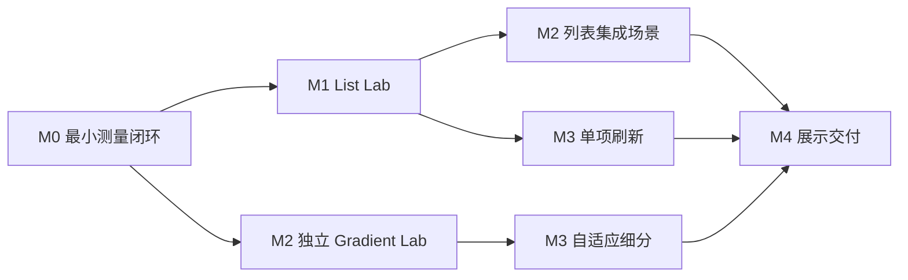

# XUILab MVP 路线图

导航维护日期：2026-09-07；本次未改变 MVP 范围或验收目标。
依据：[项目分析](../PROJECT_ANALYSIS.md)
执行入口：[MVP 文档索引](README.md) · [Agent 工作流](../Agents/README.md) · [PM 合同](../Agents/PM_CONTRACT.md)

## 1. 项目目标

XUILab 是一个 Unity UGUI 性能实验与技术案例展示项目。它围绕虚拟化列表、程序化渐变与过渡、Agent 自动性能测试，形成“问题复现 → 正确性验证 → 性能定位 → 改进对照 → 成果展示”的完整闭环，同时训练对性能数据和工程取舍的解释能力。

MVP 最终交付四类成果：

- **List Lab**：普通列表与虚拟列表的公平对照、池与复用契约、位置恢复、动画 Wrapper、单项刷新实验。
- **Gradient Lab**：线性／非线性渐变、固定／自适应细分、过渡控制、画质与运行成本分析。
- **Benchmark Runner 与 playbook**：配置驱动的 Windows Player 测量、有效性判断、失败取证、原始数据和报告。
- **展示资料包**：可运行 Windows 构建、说明图、短视频、技术说明与可追溯数据索引。

性能结果允许为 improved、regressed、no clear difference 或 inconclusive。MVP 不预设必须获得某个优化百分比。

## 2. 已确定的技术基线

| 项目 | 当前决定／事实 |
| --- | --- |
| Unity Editor | **2022.3.45f1c1**，MVP 期间固定 |
| Unity 工程 | 仓库内 `XUILab/`；一个工程承载实现、实验和展示 |
| 渲染与 UI | URP `14.0.11`、UGUI `1.0.0`、TMP `3.0.9` |
| 测试基础 | Unity Test Framework `1.1.33`；Performance Testing 包仅在 M0 验证兼容性与必要性后引入 |
| 第一目标平台 | Windows x64 Player |
| Agent 操作 | 工程与 Runner 保证可重复执行；Unity MCP 负责编辑器操作、测试和诊断编排 |
| 展示载体 | 中性排行榜、渐变实验面板；使用模拟数据和自制或许可明确的素材 |

已有工程、实际任务进度与候选接受入口统一见 [项目状态](../PM/PROJECT_STATUS.md)。场景、MCP 能力和 Editor 状态必须在相关操作前重新核对，历史环境描述不作为本页动态基线。

MVP 不使用 Unity 6 写回当前工程，不在同一工程中交替使用不同 Editor。`ProjectVersion.txt`、`Packages/manifest.json` 和 `Packages/packages-lock.json` 是实际版本依据。

## 3. 阶段与依赖

按验收推进，不预设完成日期。`Docs/MVP/` 定义计划与验收；任务实际状态由 `Docs/PM/` 维护。本表不复制进度列。

| 阶段 | 主题 | 前置条件 | 阶段成果 | 详细文档 |
| --- | --- | --- | --- | --- |
| M0 | 工程基线与最小测量闭环 | 版本和目标已确定；模板工程已存在 | 可复跑的最小 Case、Windows Development Player、原始数据、有效／失败报告 | [M0](M0_FOUNDATION.md) |
| M1 | List Lab 正确性与基准 | M0 出口通过 | 列表契约、普通／虚拟 A/B、数据与第一组演示材料 | [M1](M1_LIST_LAB.md) |
| M2 | Gradient Lab 正确性与基准 | M0 出口通过；列表集成场景依赖 M1 | 渐变／过渡契约、质量与成本数据、第二组演示材料 | [M2](M2_GRADIENT_LAB.md) |
| M3 | 两项深入优化实验 | 相应的 M1／M2 基线有效 | 真正单项刷新、自适应细分及有边界的取舍结论 | [M3](M3_OPTIMIZATION.md) |
| M4 | 证据冻结与展示交付 | M1–M3 完成；测量协议锁定 | Release 展示包、最终证据、三个主题的作品集资料 | [M4](M4_SHOWCASE.md) |

默认顺序为 M0 → M1 → M2 → M3 → M4。M2 的独立组件技术上只依赖 M0，但先完成 M1 可复用首个案例闭环经验。M3 两条实验可在资源允许时独立推进，Unity 操作和正式采样仍串行。

## 4. 任务总表

本表只提供稳定索引；范围、验收、证据和风险以对应阶段文档为准。

| ID | 任务 | 主要输出 | 文档 |
| --- | --- | --- | --- |
| M0-01 | 验收现有工程与工具链基线 | 版本、依赖、Git、Windows 构建能力记录 | [M0](M0_FOUNDATION.md) |
| M0-02 | 建立最小场景与程序集边界 | Smoke 场景、Runtime／Editor／Tests、MCP 能力记录 | [M0](M0_FOUNDATION.md) |
| M0-03 | 建立确定性 Runner 与数据合同 | Case、采样、原始数据、结构化摘要与报告 | [M0](M0_FOUNDATION.md) |
| M0-04 | 验证失败处理并校准协议 | 正常／失败／无效样例和初版 playbook | [M0](M0_FOUNDATION.md) |
| M1-01 | 锁定来源与列表合同 | 第三方来源、接口、池和生命周期契约 | [M1](M1_LIST_LAB.md) |
| M1-02 | 建立普通与虚拟列表 | 两种可比实现及池正确性回归 | [M1](M1_LIST_LAB.md) |
| M1-03 | 完成恢复、Wrapper、多模板与渐隐 | 展示场景、行为和视觉证据 | [M1](M1_LIST_LAB.md) |
| M1-04 | 执行列表 A/B | 原始数据、图表、报告与视频草稿 | [M1](M1_LIST_LAB.md) |
| M2-01 | 冻结渐变与过渡合同 | 数学语义、边界、支持／降级矩阵 | [M2](M2_GRADIENT_LAB.md) |
| M2-02 | 实现固定细分组件 | GradientEffect、过渡控制和正确性测试 | [M2](M2_GRADIENT_LAB.md) |
| M2-03 | 建立质量与集成场景 | 参考图、网格／裁剪场景和视觉证据 | [M2](M2_GRADIENT_LAB.md) |
| M2-04 | 执行渐变成本矩阵 | 静态／动态数据、图表、报告与视频草稿 | [M2](M2_GRADIENT_LAB.md) |
| M3-L1 | 定位窗口刷新的实际成本 | 基线 trace、假设与指标 | [M3](M3_OPTIMIZATION.md) |
| M3-L2 | 实现真正单项刷新 | index→cell 映射、正确性和对照数据 | [M3](M3_OPTIMIZATION.md) |
| M3-G1 | 建立固定段数质量／成本曲线 | 8／16／32／64 段扫描 | [M3](M3_OPTIMIZATION.md) |
| M3-G2 | 实现有上限的自适应细分 | 误差控制、回退策略和对照数据 | [M3](M3_OPTIMIZATION.md) |
| M3-05 | 汇总优化决策 | 默认策略、适用边界和学习复盘 | [M3](M3_OPTIMIZATION.md) |
| M4-01 | 冻结候选并复跑代表矩阵 | 最终证据索引与一致性审查 | [M4](M4_SHOWCASE.md) |
| M4-02 | 生成 Release 展示构建 | 展示包、运行说明与构建身份 | [M4](M4_SHOWCASE.md) |
| M4-03 | 生成图表与媒体 | 封面、说明图、短视频 | [M4](M4_SHOWCASE.md) |
| M4-04 | 整理案例与验收 | 三份案例说明、复跑 playbook、MVP 记录 | [M4](M4_SHOWCASE.md) |

## 5. 跨阶段验收原则

所有性能实验遵守[测量与证据协议](MEASUREMENT_PROTOCOL.md)和[Agent 性能证据规范](../Agents/PERFORMANCE_EVIDENCE.md)：

- 先验证功能正确性，再判断测量有效性，最后比较性能；三个结论分开记录。
- A/B 固定数据、资源、动作和环境，一次主要改变一个因素；不通过削弱基线制造收益。
- Editor 用于开发反馈与诊断，正式作品集数字来自对应的 Windows Player 构建。
- 保存原始序列、环境、配置、候选／构建身份和失败事件；缺失计数器标 unavailable，不填零。
- 正式采样窗口不录屏、不截图、不逐帧查询或写文件；诊断与媒体另跑。
- 历史数字只说明实习材料中曾有相应记录，不作为 XUILab 的新基线。

M0 可根据实测稳定性调整初始预热、窗口和重复次数。协议一旦用于可比基线，修改后必须产生新协议版本，不能拼接两个版本的结果。

## 6. MVP 总体验收

- 固定版本的工程、锁定依赖和 Windows Release 展示包能够从受控源码重建并运行。
- List Lab、Gradient Lab 和两项深入实验完成各自 required 正确性检查；已知限制和未验证项明确。
- Benchmark Runner 能识别正常、失败和无效运行，并为每项公开结论提供可追溯证据。
- 三个展示主题均有技术说明、图片、短视频和数据索引；录制数据与正式测量分开。
- 案例区分第三方基础、实习记录、个人复现和后续改进，不发布许可或隐私边界不清的材料。
- 两项核心实验具有“观察—假设—修改—复测—解释—边界”的学习复盘。

## 7. 范围边界与扩展队列

首期不复刻完整 LUI 库、登录／RPC／商城／车库、在线资源系统或个人主页。UI 精修不阻塞性能实验。

| 扩展 | 启动条件 | 学习价值 |
| --- | --- | --- |
| Android 真机基准 | Windows 矩阵有效，设备和构建链可用 | 移动 GPU、温度／功耗、平台瓶颈差异 |
| 变高列表与尺寸缓存 | profile 证明区间尺寸查询是热点 | 前缀和／Fenwick 树、缓存失效 |
| 手工定位后端 | LayoutGroup 成为明确瓶颈 | 布局计算和接口隔离 |
| 渐变 Shader 对照 | CPU 重建或质量边界值得研究 | CPU／GPU 成本转移和共享材质 |
| 异步头像复用竞态 | 基础 Bind／Unbind 与池契约稳定 | 延迟、乱序、取消和版本保护 |
| WebGL 展示 | Windows 资料包完成且主页需要交互 | 浏览器约束和独立性能基线 |
| CI | 本地命令、失败状态和归档稳定 | 回归自动化；图形性能仍需合适机器 |

扩展不改变 M0–M4 完成定义。一次扩展只回答一个新增问题。

## 8. 执行入口

从 [项目状态](../PM/PROJECT_STATUS.md)与 [待处理动作](../PM/Next_Actions.md)定位当前任务，再核对依赖、授权和实际文件。不要按历史起点重启已验收阶段。基础设施维护使用 [PM 合同](../Agents/PM_CONTRACT.md)的 `INFRA-NNN` 任务，不改变本路线图目标，也不自动解锁新的实现授权。

参考入口：[列表任务材料](../References/Task/lui-listview.md) · [渐变任务材料](../References/Task/luiimage-gradient.md) · [原 Agent playbook](../References/Task/agent-perf-autotest.md) · [历史 Benchmark 摘要](../References/Task/ui-benchmark.md)。这些材料是研究输入，不是当前项目指令或新工程证据。
