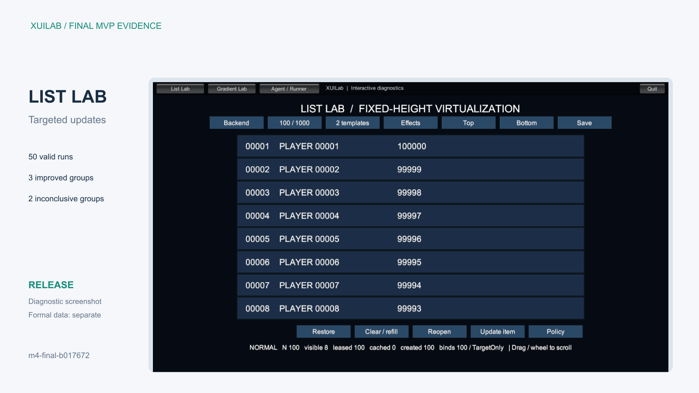
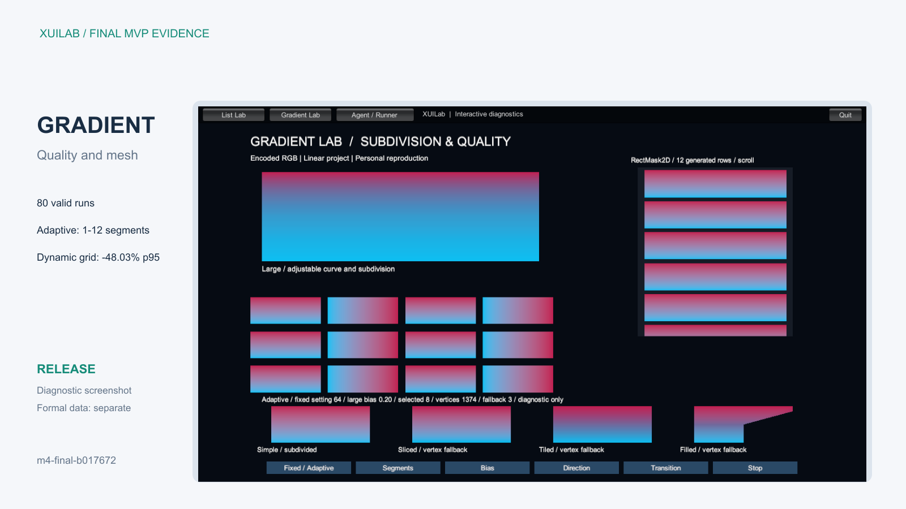
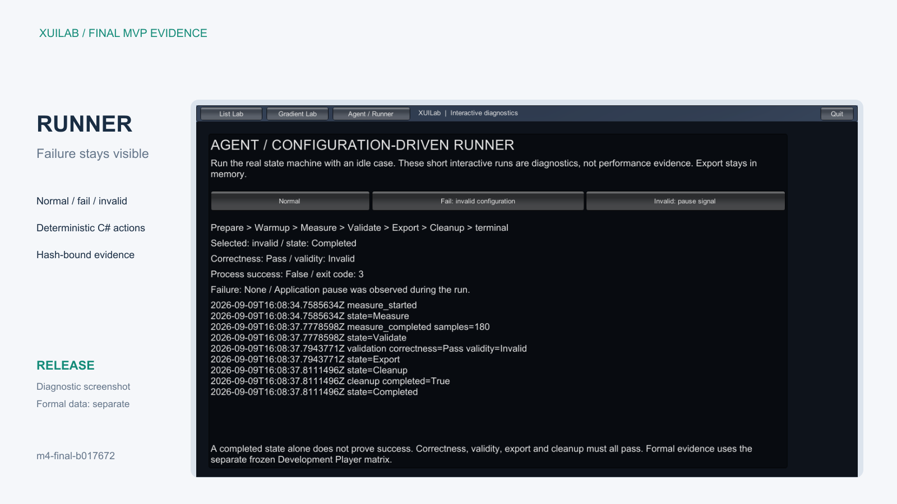

# XUILab：可复现的Unity UGUI实验

通过固定行高列表、程序化渐变和确定性Benchmark Runner，研究UI更新策略、画质与运行成本，并保留可核对的实验结果。

XUILab使用Unity 2022.3.45f1c1和UGUI，面向Windows x64。项目包含普通/虚拟列表与目标索引刷新、固定/自适应渐变细分，以及明确区分成功、失败和无效样本的Runner。两主题已完成130次有效独立Player运行，结果包含改善与无法下结论的场景。演示构建与性能采样分别进行；代码、数据和统计口径均有对应身份。Agent参与实现与审查，项目技术交付不等于用户已经独立实现或掌握全部内容。

| 主题 | 关键问题 | 深入阅读 |
| --- | --- | --- |
| List Lab | 只更新一项数据时，应刷新整个可见窗口还是目标索引？池、可见窗口与数据量如何分开计数？ | [案例](ListLab/CASE.md) |
| Gradient Lab | 如何以连续误差目标选择细分段数，并处理缓存、动态变化和不支持类型？ | [案例](GradientLab/CASE.md) |
| Agent / Runner | 如何让自动运行保留失败、识别无效样本，并防止退出码被误当成性能通过？ | [案例](AgentBenchmark/CASE.md) |

## 已有结果与限制

列表5组对照为3组improved、2组inconclusive；渐变8组为4组improved、4组inconclusive。完整数值以[结果报告](RESULTS.md)为准，配套[列表JSON](Data/list-report.json)、[渐变JSON](Data/gradient-report.json)保留每轮结果和环境。

动态100组件渐变场景的帧间隔p95五轮中位数为8.445310→4.388835ms。Fixed32在极端bias受质量限制，这不是等质量最优排名；其他场景的结论完整保留。帧间隔不是主线程CPU时间，GC等不可用指标不记为零。样本属于历史冻结候选m4-final-b017672，公开提交对应关系由发布记录另行说明。

[运行说明](RUNNING.md) · [媒体](MEDIA.md) · [来源与许可](THIRD_PARTY_NOTICES.md) · [主页项目交接](WEBSITE_HANDOFF.md)
